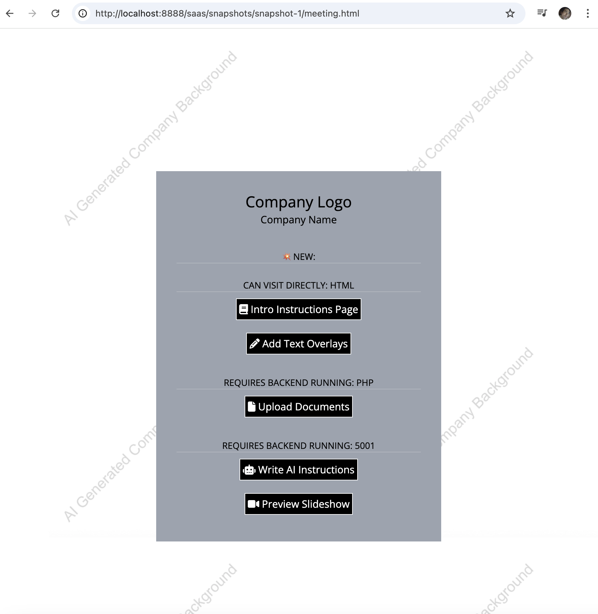
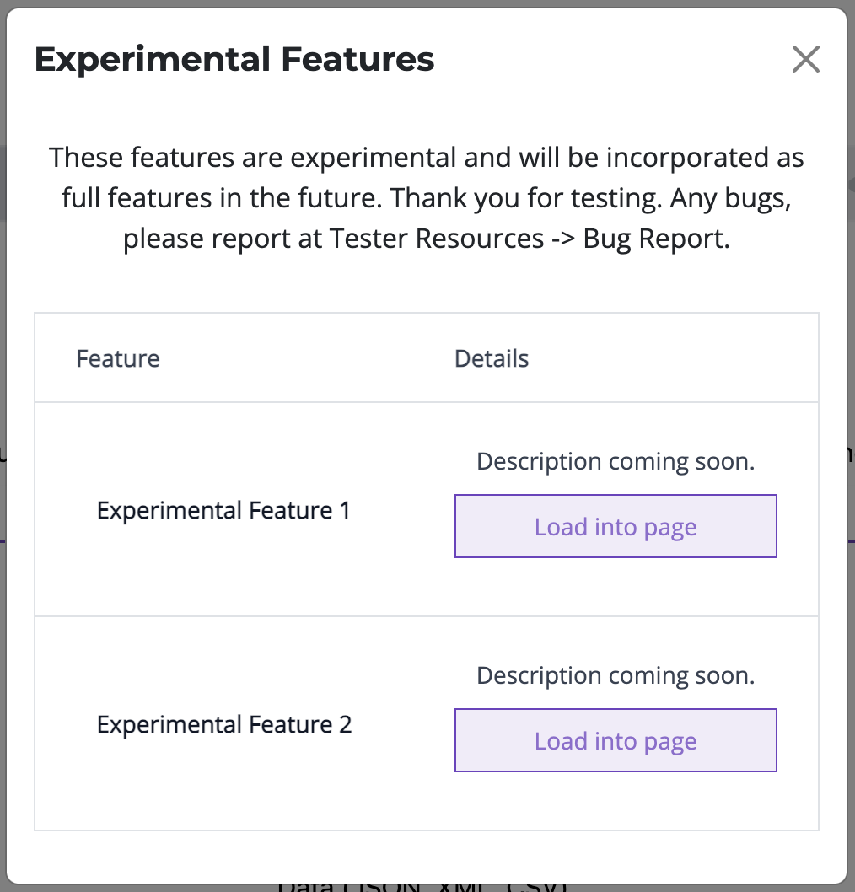
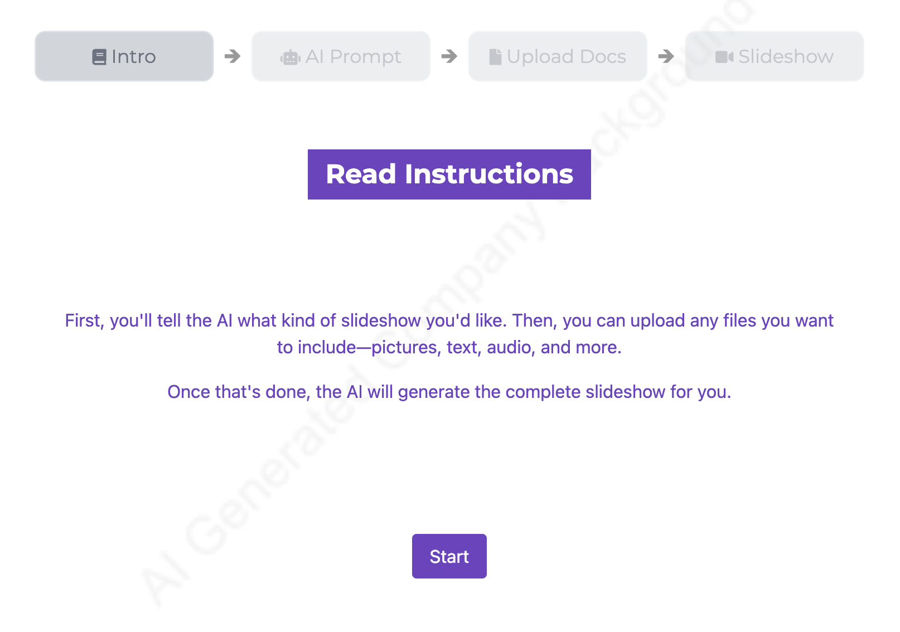

# Boilerplate - Agile AI-Powered Full Stack SaaS App


<a target="_blank" href="https://github.com/Siphon880gh" rel="nofollow"></a>
<a target="_blank" href="https://www.linkedin.com/in/weng-fung/" rel="nofollow"></a>
<a target="_blank" href="https://www.youtube.com/@WayneTeachesCode/" rel="nofollow"></a>

A self-contained full stack app that can deploy mixed PHP Python server for using AI to create slideshows with your documents (pictures, texts, pdf's, spreadsheets, podcasts, url's, etc). But easy enough for you to remove the spreadsheet creation which is just a placeholder for you to add your own use case.

The app is broken into multiple snapshots. The first snapshot is focused on developing parts of the apps that can be visited at meeting.html where cofounders discuss the parts of the app.

The second snapshot is when the individual demo's are combined into an app once the cofounder agrees on the features and the user flosw.

Third snapshot has user authentication, user accounts, and json web token for persistent login. A database is implemented to persist users and their slideshow creations. This allows users to make their own AI powered slideshows. There's a credit system to help with managing your subscription tiers. you can expand from here adding subscription add-ons. 

Fourth snapshot focuses on build scripts to quickly migrate the code online and to keep a persistent environment. For this purpose we are using pipenv and supervisor, rather than docker and kubernetes. A boilerplate for docker and kubernetes is coming soon for a future separate repository.

In summary, this is agile because it's streamlined iteration processes with your team using developed modular components, and then it remains agile because then you combine the demo's into an app with user flow, then integrate user authentication / user management / daabases, and finally we sprinkle consistent environment that's scalable to future user traffic growth. The placeholder boilerplate is capable of connecting to ChatGPT for rewriting user's input, so it's AI assisted. With user memberships and tiers, this is a SaaS boilerplate.


## I. Small Demo's with Team (Snapshot 1)

Visit `snapshots/snapshot-1-demos/meeting.html`

This snapshot is focused on developing parts of the apps that can be visited at meeting.html where cofounders discuss the parts of the app over a zoom or conference room projector.

You open meeting.html file and visit each part of the app as the team critiques and suggests the look and features. The features are not connected to each other yet because the best user flow hasn't been decided:


### Demos

For the placeholder app, we have:
app-add-text-overlays/
app-preview-slideshow/
app-read-instructions/
app-upload-files/
app-write-prompt/

Each described here in a possible user flow:
- **app-read-instructions:** User reads a quick introduction (at read instructions) on how the app works. 

- **app-write-prompt:** On another page, the user types instructions to the AI on how to use their files to create the slideshow, if the slideshow is for schooling or business purposes, etc. You would discuss plans of implementing an AI that rewrites the instructions so that the AI slideshow creator can best understand it (Next snapshot).

- **app-upload-files and app-add-text-overlays:** User uploads various documents that the AI will combine into a slideshow. They can be pictures, podcasts, text, pdf, videos, etc. User can label their graphics which the AI can use to create more accurate slideshows (php partial app-add-text-overlays).

- **app-preview-slideshow:** Finally, user waits for the slideshow to get generated. Once it generates, they can watch the video. For demonstration purposes, you can have a placeholder video because the team is critiquing each part of the app at this phase.

The previewslideshow has a "Share" ability to email and text because you want a viralty aspect to user growth by having users share their creations. Therefore, the agile team would discuss the preview slideshow as well as the sharing ability. It obviously doesn't share a live url but a mocked demo/demo.mp4. The code for sharing which prepopulates your gmail and email add is at root app/index.js's shareController.

### Best Practice 1: Flag switch demo (modular demo's) versus live (user flow)

Each demo should have a flag to switch between demo and live mode. Live mode is when in snapshot 2, you would have the parts connected in an user flow (so that you can click a "Next" button and another part of the app opens). We'll have them all in demo mode for demonstrating to the agile team:

- **app-add-text-overlays**: This is a PHP partial for one of the other demo's, though you will be demonstrating the PHP partial by itself, therefore the flag is in PHP to impact its layout to be seen individually (without relying on any css of a parent layout):

```

    <?php
    /* config-phase */
    $pageMode = [
        'MODES' => [
            'DEMO' => 0,
            'LIVE' => 1
        ],
        'currentMode' => null
    ];

    // -> CONFIG HERE:
    $pageMode['currentMode'] = $pageMode['MODES']['DEMO'];
```

^ The flag would be switching `DEMO` or `LIVE` at `$pageMode['currentMode'] = $pageMode['MODES']['DEMO'];`

- Most other demo's will have a javascript flag, usually reassigning the submit function to either messageSelf (because this is a self contained demo) or messageParent (because Snapshot 2 where you have an user flow will actually be iframe opening iframe's on a parent page):

```
  <script class="config-phase">
      const pageMode = {
        MODES: {
          DEMO: 0,
          LIVE: 1,
        },
        currentMode: null,
      };

      // -> CONFIG HERE:
      pageMode.currentMode = pageMode.MODES.DEMO;

      function messageParent() {
        window.parent.mainController.proceedFromInstructions();
      }

      function messageSelf() {
        alert("DONE. Let's pretend we go to the next page - User will write AI prompt to design the slideshow.")
      }

      let submit = () => {}
      if (pageMode.currentMode === pageMode.MODES.LIVE) {
        submit = messageParent; // No args to pass in
      } else {
        submit = messageSelf;
      }
  </script>
```

^ The flag would be switching `DEMO` or `LIVE` at `pageMode.currentMode = pageMode.MODES.DEMO;`

### Best Practice 2: Common CSS

Each demo should link to a common css file (like common.css) that is outside the demo folder. So you can start playing with the company's brand colors and identity on the individual demo's and keep things DRY as the agile team may still be formulating the colors. Then you can adjust the css at one place for all the demo's.


### Best Practice 3: Cache Busting

Implemented a cache busting at all demo's by using a common assets/version-cache-bust.php. You could have it always cache bust with a random number or a time() or have it cache incrementally with a version number. Cache busting is necessary at this stage if you will be sharing the links to stakeholders who may not be technical enough to know how to clear their cache (when they can't see your latest changes). This cache busting and cache control can carry to the rest of the future snapshots.

You may see PHP snippets like this at many of the demo's, which is just a sugar syntax available in PHP to make it easy to code in $v for the cache busting portion of the URL, and that $v is controlled by version-cache-bust.php:
```
<?php
echo <<<cbust_ipad
  <script src="assets/common.css$v"></script>
cbust_ipad;
?>
```


---

## II. Combine Small Demo's into Full Frontend App (Snapshot 2)

Visit `snapshots/snapshot-2-app/app/` on a PHP server

Let's say the Agile cofounder team likes the modular demo's. And the team has agreed on the user flow.

It's time to create the app where the user can navigate from one page to another page. We build onto the Snapshot 1 files by adding more files with the main goal of connecting all the demo's with each other as modules that flow from point A to point Z.

### Menu

You may want a menu especially for certain parts of the app that can be accessed without having to go from point A to Z. This is a good point to design the menu with placeholder items like Logout, Signup, Edit Profile, Go to Dashboard, etc. The menu is also a good place for the user's eyes to see the Credits remaining. Although this is a good place to add user authentication, user accounts, credits, etc we'll focus on that on the next snapshot. Therefore this snapshot will be a full frontend app.

Furthermore for the menu, when releasing the app, you may want users to report bugs and suggest features, so the menu may be a good place for Google Form links (or design your own on the website to make it look consistent with the brand).

Some menu items may benefit from a drawer or dropdown approach that opens a secondary menu, therefore we have a dropdown.css at assets/.

Going back to the Google forms, it'll best fit the drawer or dropdown criteria.

menus/app.php:
```
<div class="dropdown-wrapper logged-in hidden-important">
  <a href="javascript:void(0)" class="dropdown-toggle">Tester Resources</a>
  <div class="dropdown-content">
      <a href="#" target="_blank">Survey</a>
      <a href="#" target="_blank">Report Bug</a>
      <a href="#" target="_blank">Request Feature</a>
  </div>
</div>
```

### Modal windows

You may want modal window for information that needs focused or points of the app that's important. Things to appear in a modal window include login, signup, and walkthrough videos. The modal window allows the user to click out to return back to the app especially if a modal is a "pause point" (for example, user watching a walkthrough video to get the gist of the app). The walkthrough video could be accessed on and individual page (for a walkthrough on that particular feature) and/or from the menu (for a walkthrough of the entire app). Because we are using PHP, we can have a modals.php at the app root that is rendered into index.php. Any of the demo's will be able to access the modal to fill it dynamically or to simply hide/unhide it.

This boilerplate includes the menu and modal window system we just talked about at modals.php and menus/app.php. The menu named as an "app menu". You could add submenu's in the same folder and name them appropriately.

The menu item "Walkthrough" opens a modal that plays the video at assets/videos/demo-walkthrough.mp4 which is a placeholder video.

We've added an experimental modal that's only accessible by stakeholders through knowledge of the password, and it's where you could add features to be tested but not available to other testers. You type "secret" on the webpage and a modal with the Experimental features open:



^The typing password secret is made possible by the secretMenu.init() method in root assets/index.js.

### Alpine JS Iframes and Unified Model

With a root index.php that has modals and all the demo's, you have several choices: 
- Can paste all the demo's codes into the app and have the demo's dynamically hide/unhide. This is too much work especially when your team may still be showing the individual demo as you're building the user flow in the app.
- Have an iframe that navigates to another page. This iframe will navigate through all the pages. This is a candidate.
- Have multiple iframes, each iframe to each demo. The iframe could be blank until it's time to render when the user reaches that point of the app, or it could be pre-rendered ahead of time. The disadvantage is slow internet connections could suffer and the complexity of the code. The advantage is that you can appear to render the page quickly (by unhiding) and you could have access to user entry from previous iframe's. Regardless of having access to previous iframes, we will still have a data model so we can have a point of truth for saving to database or displaying previous information into the DOM.

We choose the multiple iframes, each iframe loading a module, for this boilerplate.

As for MVC, we have a model called `appModel` at root assets/index.js. To see the unified model in action, you can visit the app, then go through entering slideshow instructions and press "Continue" to go to the page where you upload files. Open DevTools console and run `window.parent.appModel.aiPrompt`. You'll see the typed prompt has been saved to this global object outside of the Iframes, and therefore any Iframe has access to it via `window.parent...`.

As for each module, it no longer self messages but messages the parent (parent index.js whereas each module is inside an iframe). Usually when flag is DEMO, the continue or next button calls messageSelf, or if LIVE then it calls messageParent assigned to a function at `mainController` at the root assets/index.js. Some iframes will load when it's their turn and some may be loaded ahead of time before being visible by Alpine js. 

In the above ways, we have an unified MVC for the iframes. The views will be discussed as we get more detailed about the iframes in the next paragraphs.

We made sure to flip the switch to `LIVE` on all modules:
```
/* PHP */
// -> CONFIG HERE:
$pageMode['currentMode'] = $pageMode['MODES']['LIVE'];

/* JS in script block */
// -> CONFIG HERE:
pageMode.currentMode = pageMode.MODES.LIVE;
```

Because we use multiple iframes, we use Alpine JS that displays only one iframe depending on the "activePanel" value. That activePanel value has been enumerated for DRY and to prevent bugs - that enumeration is in assets/screens.js

You can adjust SCREENS enum from this code snippet and assets/screens.js to be semantic with your business logic. Adjust the folder or file path at iframe. Give the iframe an id if you will use js to manipulate the src. The data-will-src is optional but it refreshes the page when conditionally make it visible with alpine js. Alpine js we will change activePanel which will make their corresponding iframe visible while hiding other iframes.

In addition, we have a `navController` which can control behaviors of user clicking back/forth and switching to iframes (behaviors such as reloading the iframe or simply unhiding a preloaded iframe). The main feature is its method `switchPanel` which using enumerations (assets/screens.js) representing the iframes as the first mandatory argument, we can choose which iframe displayed. Running `switchPanel` with true as a second optional argument will forcefully reload that iframe (either from the url in iframe tag's data-will-src or the src, whichever available). The reason why src may be empty or about:blank, is we may want some iframes not to load until the user reaches that point needing the iframe for the first time.

```
      <!-- Panel 1 -->
      <div id="panel-1" x-show="activePanel === SCREENS.ReadInstructions" class="dynamic-panel min-h-screen min-w-screen z-40"
        data-off-class="dynamic-panel-1 bg-white p-6 border rounded-lg ">
        <iframe id="iframe-text-details" src="app-text-details/" class="dynamic-panel min-h-screen min-w-screen" frameborder="0" width="100%"
          height="100%"></iframe>
      </div>


      <!-- Panel 2 -->
      <div id="panel-2" x-show="activePanel === SCREENS.WritePrompt" class="dynamic-panel min-h-screen min-w-screen" style="display: none;"
      >
        <iframe id="iframe-select-voice" src="about:blank" data-will-src="app-select-voice/" class="min-h-screen min-w-screen z-40" frameborder="0" width="100%"
          height="100%"></iframe>
      </div>
```

You set which Alpine JS iframe is the first to appear on the page when user visits `app/` or `app/index.php` at this line:
```
<div id="panel-containers" x-data="{ activePanel: SCREENS.ReadInstructions }" x-init="window.activePanel = activePanel"
```

In the future, if you have to insert new pages inbetween, you can have them as IDs 10X, for example, 101 between 1 and 2, then eventually reorder them to be 1, 2 (the new one), 3 and make sure updating assets/screens.js constants to reflect that. If you’re adding pages before page 1 (like 3 additional pages), you can use -1, -2, -3

Not all the `app-NAME` folders like `app-write-prompt` are Alpine JS iframes, especially as the app grows in complexity. For example, `app-add-text-overlays` is NOT an Alpine JS iframe - it's a PHP partial that does go into another Alpine JS iframe `app-upload-files`. Therefore, you should comment at the top of each module's index.php or index.html, AND create a documentation of what type of modules they are. Here are example top line comments:
```
<!-- Module type: PHP partial at an iframe module "app-upload-files" -->
<!-- Module type: iframe module -->
<!-- Module type: iframe rerouter module that redirects to another iframe module after saving resuming models to window.parent -->
```

^ Btw the rerouter module we don't have for this snapshot. It'll be a future snapshot where a user can edit a completed slideshow and a resuming model will be referenced to re-render the app-write-prompt page with the old instructions the user had provided. This will be covered when we add user ability, which we don't have in this snapshot (is all frontend).

### Many online features skipped for now

Because we don't have user authentication yet, it doesn't make sense to add AI assisted writing of the slideshow instructions or to add actual file uploading. It'll only crowd the files. We will add user features in the next snapshot.

### Brand Combo Switching in Lieu of Whitelabeling

Because we now are making a full frontend app, you may want to offer different combinations of colors, fonts, button styles, etc to the team. Therefore, we created a whitelabeling system that allows switching style assets and settings depending on the "company", but for the purposes of snapshot 2 where your app is not online yet, it's experimenting with different color combinations. Looking at `assets--whitelabeler/` you'll see there are different sets of css files for default and partner1. At each demo, aka module, the code refers to a `brand-loader.php` to determine whether to load the default or partner1. And at index.php which frames the entire app, you see in the code a brand-loader.php as well because there are visual elements on the rest of the app around the iframe. That index.php ALSO has code referencing `brand-loader-by-url.php` which looks for a ?`co=default` or `?co=partner1` in the url to override which brand colors to load in (say you send a custom url to a stakeholder to see how certain color combinations look). There are js and php files whihc are simply variables to the name of the company, colors, logo paths, etc that are needed to complete the styling.

We moved our common brand styling for the demo's from `assets/common.css` (as in Snapshot 1) out into `assets--whitelabeler`. Notice in this snapshot, the common.css is shorter in code. Common.css still makes sense to have because it could have styling rules that applies to the app regardless of brand or color combination.

Set the base colors at:
```
/* OUR BRAND COLORS */
:root {
    --primary-color: #6F42C1 !important;
    --primary-color-tinted: #9F74D5 !important;
    /* Lighter version of #6F42C1 */
    --primary-color-shaded: #4B2C86 !important;
    /* Darker version of #6F42C1 */
    --primary-color-contrasted: white !important;

    --primary-color-o10: rgba(111, 66, 193, 0.10) !important;
    --primary-color-o20: rgba(111, 66, 193, 0.20) !important;
    --primary-color-o30: rgba(111, 66, 193, 0.30) !important;
    --primary-color-o75: rgba(111, 66, 193, 0.75) !important;
    --primary-color-o80: rgba(111, 66, 193, 0.80) !important;

    --main-background: url("./background-default.jpg");

    --heading-font: Montserrat, sans-serif !important;
    --body-font: 'Open Sans' !important;
    --text: black;
}
...
```
And use the brand styling classes like textcolor-brand, h2-brand, etc found in the same css file


### Breadcrumb steps

If there is a linear user flow, as is the case with our placeholder app that creates slideshow using AI, you'd want to add breadcrumbs to the top of each page. For each module, we added this code:
```
  <?php
    $step=1;
    include("../assets/steps.php");
  ?>
```

In combination with assets/steps.php and assets/steps.css, it highlights which part of the app the user is in. You can adjust steps.php to add your pages or insert your own app:



This steps snippet wouldn't be added to `app-add-text-overlays` because that's a PHP partial to be rendered inside of `app-upload-files` which does have the breadcrumb step because that's the page the user hits.

### Favico, meta tags, etc

The favico is a white square. You could work with your team to design the favico for the website (the icon that appears on browser tab, favorites, and Google search engine). Tip when designing icons and logos, you guys may want to work on only a black and white graphic, then later discuss the colors.

In a related note, you may want to adjust the meta tags at index.php. It makes sense as you're discussing how the app works as a whole, and how it looks to keep brand identity, then you may want to discuss how the app is seen on the google search, at least preliminarily. Having no meta tags or improper meta tags could harm your SEO when deploying online soon, so having something is better than nothing. Then later you can work with the marketing department to make the meta tags better. For instance, meta tags include at root index.php:

```
<meta property="og:title" content="COMPANY_NAME" />
```


---

## III. User Ability and Database (Snapshot 3)


**TO BE CONTINUED... WIP since 3/1/25**