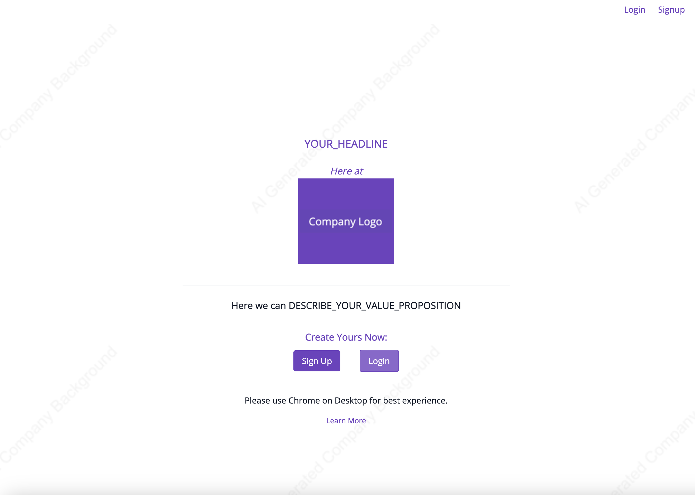
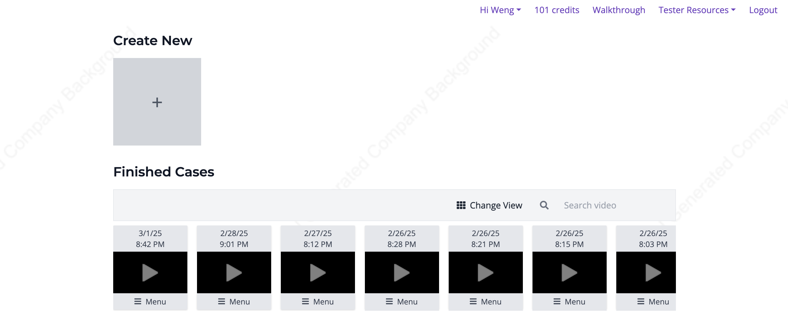
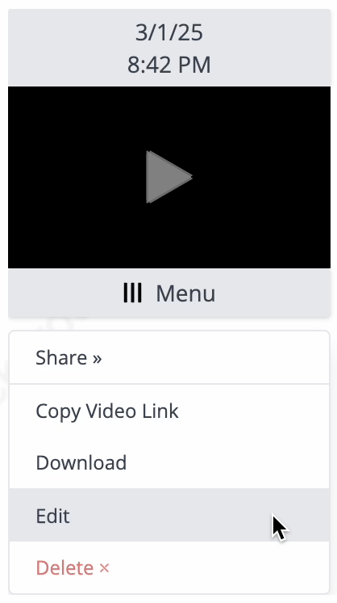
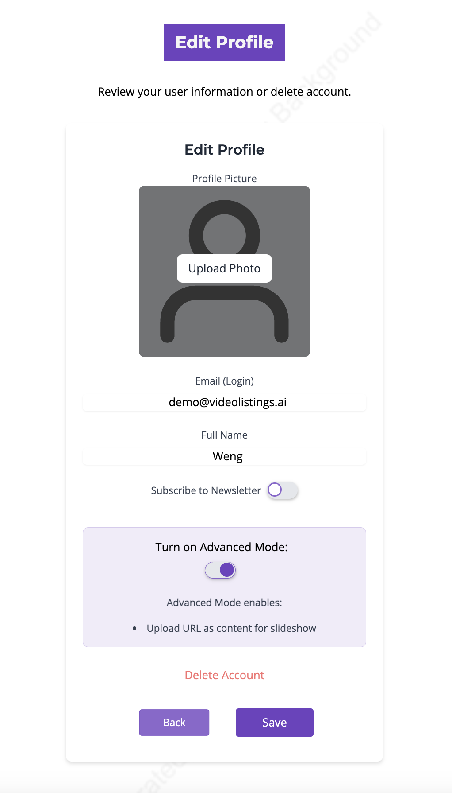
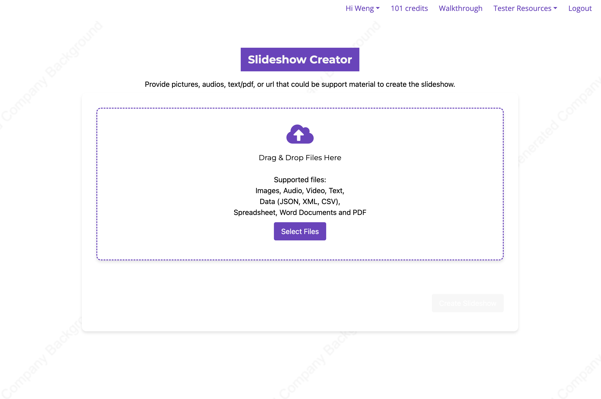
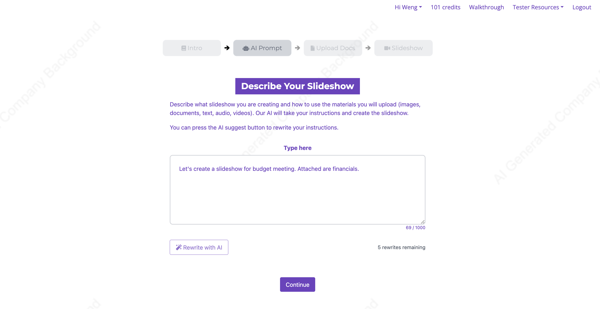

# Boilerplate - Agile AI-Powered Full Stack SaaS App


<a target="_blank" href="https://github.com/Siphon880gh" rel="nofollow"></a>
<a target="_blank" href="https://www.linkedin.com/in/weng-fung/" rel="nofollow"></a>
<a target="_blank" href="https://www.youtube.com/@WayneTeachesCode/" rel="nofollow"></a>

A self-contained full stack app that can deploy mixed PHP Python server for using AI to create slideshows with your documents (pictures, texts, pdf's, spreadsheets, podcasts, url's, etc). But easy enough for you to remove the spreadsheet creation which is just a placeholder for you to add your own use case.

The app is broken into multiple snapshots. The first snapshot is focused on developing parts of the apps that can be visited at meeting.html where cofounders discuss the parts of the app.

The second snapshot is when the individual demo's are combined into an app once the cofounder agrees on the features and the user flosw.

Third snapshot has user authentication, user accounts, and json web token for persistent login. A database is implemented to persist users and their slideshow creations. This allows users to make their own AI powered slideshows. There's a credit system to help with managing your subscription tiers. you can expand from here adding subscription add-ons. 

Fourth snapshot focuses on build scripts to quickly migrate the code online and to keep a persistent environment. For this purpose we are using pipenv and supervisor, rather than docker and kubernetes. A boilerplate for docker and kubernetes is coming soon for a future separate repository.

Fifth snapshot goes beyond into business analytics (with free metabase), user data reporting, and why not - maintainability with git submodules.

snapshots/snapshot-1-demos
snapshots/snapshot-2-app
snapshots/snapshot-3-users
snapshots/snapshot-4-deploy
snapshots/snapshot-5-bi

In summary, this is agile because it's streamlined iteration processes with your team using developed modular components, and then it remains agile because then you combine the demo's into an app with user flow, then integrate user authentication / user management / daabases, and finally we sprinkle consistent environment that's scalable to future user traffic growth. The placeholder boilerplate is capable of connecting to ChatGPT for rewriting user's input, so it's AI assisted. With user memberships and tiers, this is a SaaS boilerplate.

## I. Small Demo's with Team (Snapshot 1)

Visit `snapshots/snapshot-1-demos/meeting.html`

This snapshot is focused on developing parts of the apps that can be visited at meeting.html where cofounders discuss the parts of the app over a zoom or conference room projector.

You open meeting.html file and visit each part of the app as the team critiques and suggests the look and features. The features are not connected to each other yet because the best user flow hasn't been decided:


### Demos

For the placeholder app, we have:
app-add-text-overlays/
app-preview-slideshow/
app-read-instructions/
app-upload-files/
app-write-prompt/

Each described here in a possible user flow:
- **app-read-instructions:** User reads a quick introduction (at read instructions) on how the app works. 

- **app-write-prompt:** On another page, the user types instructions to the AI on how to use their files to create the slideshow, if the slideshow is for schooling or business purposes, etc. You would discuss plans of implementing an AI that rewrites the instructions so that the AI slideshow creator can best understand it (Next snapshot).

- **app-upload-files and app-add-text-overlays:** User uploads various documents that the AI will combine into a slideshow. They can be pictures, podcasts, text, pdf, videos, etc. User can label their graphics which the AI can use to create more accurate slideshows (php partial app-add-text-overlays).

- **app-preview-slideshow:** Finally, user waits for the slideshow to get generated. Once it generates, they can watch the video. For demonstration purposes, you can have a placeholder video because the team is critiquing each part of the app at this phase.

The previewslideshow has a "Share" ability to email and text because you want a viralty aspect to user growth by having users share their creations. Therefore, the agile team would discuss the preview slideshow as well as the sharing ability. It obviously doesn't share a live url but a mocked demo/demo.mp4. The code for sharing which prepopulates your gmail and email add is at root app/index.js's shareController.

### Best Practice 1: Flag switch demo (modular demo's) versus live (user flow)

Each demo should have a flag to switch between demo and live mode. Live mode is when in snapshot 2, you would have the parts connected in an user flow (so that you can click a "Next" button and another part of the app opens). We'll have them all in demo mode for demonstrating to the agile team:

- **app-add-text-overlays**: This is a PHP partial for one of the other demo's, though you will be demonstrating the PHP partial by itself, therefore the flag is in PHP to impact its layout to be seen individually (without relying on any css of a parent layout):

```

    <?php
    /* config-phase */
    $pageMode = [
        'MODES' => [
            'DEMO' => 0,
            'LIVE' => 1
        ],
        'currentMode' => null
    ];

    // -> CONFIG HERE:
    $pageMode['currentMode'] = $pageMode['MODES']['DEMO'];
```

^ The flag would be switching `DEMO` or `LIVE` at `$pageMode['currentMode'] = $pageMode['MODES']['DEMO'];`

- Most other demo's will have a javascript flag, usually reassigning the submit function to either messageSelf (because this is a self contained demo) or messageParent (because Snapshot 2 where you have an user flow will actually be iframe opening iframe's on a parent page):

```
  <script class="config-phase">
      const pageMode = {
        MODES: {
          DEMO: 0,
          LIVE: 1,
        },
        currentMode: null,
      };

      // -> CONFIG HERE:
      pageMode.currentMode = pageMode.MODES.DEMO;

      function messageParent() {
        window.parent.mainController.proceedFromInstructions();
      }

      function messageSelf() {
        alert("DONE. Let's pretend we go to the next page - User will write AI prompt to design the slideshow.")
      }

      let submit = () => {}
      if (pageMode.currentMode === pageMode.MODES.LIVE) {
        submit = messageParent; // No args to pass in
      } else {
        submit = messageSelf;
      }
  </script>
```

^ The flag would be switching `DEMO` or `LIVE` at `pageMode.currentMode = pageMode.MODES.DEMO;`

### Best Practice 2: Common CSS

Each demo should link to a common css file (like common.css) that is outside the demo folder. So you can start playing with the company's brand colors and identity on the individual demo's and keep things DRY as the agile team may still be formulating the colors. Then you can adjust the css at one place for all the demo's.


### Best Practice 3: Cache Busting

Implemented a cache busting at all demo's by using a common assets/version-cache-bust.php. You could have it always cache bust with a random number or a time() or have it cache incrementally with a version number. Cache busting is necessary at this stage if you will be sharing the links to stakeholders who may not be technical enough to know how to clear their cache (when they can't see your latest changes). This cache busting and cache control can carry to the rest of the future snapshots.

You may see PHP snippets like this at many of the demo's, which is just a sugar syntax available in PHP to make it easy to code in $v for the cache busting portion of the URL, and that $v is controlled by version-cache-bust.php:
```
<?php
echo <<<cbust_ipad
  <script src="assets/common.css$v"></script>
cbust_ipad;
?>
```


---

## II. Combine Small Demo's into Full Frontend App (Snapshot 2)

Visit `snapshots/snapshot-2-app/app/` on a PHP server

Let's say the Agile cofounder team likes the modular demo's. And the team has agreed on the user flow.

It's time to create the app where the user can navigate from one page to another page. We build onto the Snapshot 1 files by adding more files with the main goal of connecting all the demo's with each other as modules that flow from point A to point Z.

### Menu

You may want a menu especially for certain parts of the app that can be accessed without having to go from point A to Z. This is a good point to design the menu with placeholder items like Logout, Signup, Edit Profile, Go to Dashboard, etc. The menu is also a good place for the user's eyes to see the Credits remaining. Although this is a good place to add user authentication, user accounts, credits, etc we'll focus on that on the next snapshot. Therefore this snapshot will be a full frontend app.

Furthermore for the menu, when releasing the app, you may want users to report bugs and suggest features, so the menu may be a good place for Google Form links (or design your own on the website to make it look consistent with the brand).

Some menu items may benefit from a drawer or dropdown approach that opens a secondary menu, therefore we have a dropdown.css at assets/.

Going back to the Google forms, it'll best fit the drawer or dropdown criteria.

menus/app.php:
```
<div class="dropdown-wrapper logged-in hidden-important">
  <a href="javascript:void(0)" class="dropdown-toggle">Tester Resources</a>
  <div class="dropdown-content">
      <a href="#" target="_blank">Survey</a>
      <a href="#" target="_blank">Report Bug</a>
      <a href="#" target="_blank">Request Feature</a>
  </div>
</div>
```

### Modal windows

You may want modal window for information that needs focused or points of the app that's important. Things to appear in a modal window include login, signup, and walkthrough videos. The modal window allows the user to click out to return back to the app especially if a modal is a "pause point" (for example, user watching a walkthrough video to get the gist of the app). The walkthrough video could be accessed on and individual page (for a walkthrough on that particular feature) and/or from the menu (for a walkthrough of the entire app). Because we are using PHP, we can have a modals.php at the app root that is rendered into index.php. Any of the demo's will be able to access the modal to fill it dynamically or to simply hide/unhide it.

This boilerplate includes the menu and modal window system we just talked about at modals.php and menus/app.php. The menu named as an "app menu". You could add submenu's in the same folder and name them appropriately.

The menu item "Walkthrough" opens a modal that plays the video at assets/videos/demo-walkthrough.mp4 which is a placeholder video.

We've added an experimental modal that's only accessible by stakeholders through knowledge of the password, and it's where you could add features to be tested but not available to other testers. You type "secret" on the webpage and a modal with the Experimental features open:


^The typing password secret is made possible by the secretMenu.init() method in root assets/index.js.

### Alpine JS Iframes and Unified Model

With a root index.php that has modals and all the demo's, you have several choices: 
- Can paste all the demo's codes into the app and have the demo's dynamically hide/unhide. This is too much work especially when your team may still be showing the individual demo as you're building the user flow in the app.
- Have an iframe that navigates to another page. This iframe will navigate through all the pages. This is a candidate.
- Have multiple iframes, each iframe to each demo. The iframe could be blank until it's time to render when the user reaches that point of the app, or it could be pre-rendered ahead of time. The disadvantage is slow internet connections could suffer and the complexity of the code. The advantage is that you can appear to render the page quickly (by unhiding) and you could have access to user entry from previous iframe's. Regardless of having access to previous iframes, we will still have a data model so we can have a point of truth for saving to database or displaying previous information into the DOM.

We choose the multiple iframes, each iframe loading a module, for this boilerplate.

As for MVC, we have a model called `appModel` at root assets/index.js. To see the unified model in action, you can visit the app, then go through entering slideshow instructions and press "Continue" to go to the page where you upload files. Open DevTools console and run `window.parent.appModel.aiPrompt`. You'll see the typed prompt has been saved to this global object outside of the Iframes, and therefore any Iframe has access to it via `window.parent...`.

As for each module, it no longer self messages but messages the parent (parent index.js whereas each module is inside an iframe). Usually when flag is DEMO, the continue or next button calls messageSelf, or if LIVE then it calls messageParent assigned to a function at `mainController` at the root assets/index.js. Some iframes will load when it's their turn and some may be loaded ahead of time before being visible by Alpine js. 

In the above ways, we have an unified MVC for the iframes. The views will be discussed as we get more detailed about the iframes in the next paragraphs.

We made sure to flip the switch to `LIVE` on all modules:
```
/* PHP */
// -> CONFIG HERE:
$pageMode['currentMode'] = $pageMode['MODES']['LIVE'];

/* JS in script block */
// -> CONFIG HERE:
pageMode.currentMode = pageMode.MODES.LIVE;
```

Because we use multiple iframes, we use Alpine JS that displays only one iframe depending on the "activePanel" value. That activePanel value has been enumerated for DRY and to prevent bugs - that enumeration is in assets/screens.js

You can adjust SCREENS enum from this code snippet and assets/screens.js to be semantic with your business logic. Adjust the folder or file path at iframe. Give the iframe an id if you will use js to manipulate the src. The data-will-src is optional but it refreshes the page when conditionally make it visible with alpine js. Alpine js we will change activePanel which will make their corresponding iframe visible while hiding other iframes.

In addition, we have a `navController` which can control behaviors of user clicking back/forth and switching to iframes (behaviors such as reloading the iframe or simply unhiding a preloaded iframe). The main feature is its method `switchPanel` which using enumerations (assets/screens.js) representing the iframes as the first mandatory argument, we can choose which iframe displayed. Running `switchPanel` with true as a second optional argument will forcefully reload that iframe (either from the url in iframe tag's data-will-src or the src, whichever available). The reason why src may be empty or about:blank, is we may want some iframes not to load until the user reaches that point needing the iframe for the first time.

```
      <!-- Panel 1 -->
      <div id="panel-1" x-show="activePanel === SCREENS.ReadInstructions" class="dynamic-panel min-h-screen min-w-screen z-40"
        data-off-class="dynamic-panel-1 bg-white p-6 border rounded-lg ">
        <iframe id="iframe-text-details" src="app-text-details/" class="dynamic-panel min-h-screen min-w-screen" frameborder="0" width="100%"
          height="100%"></iframe>
      </div>


      <!-- Panel 2 -->
      <div id="panel-2" x-show="activePanel === SCREENS.WritePrompt" class="dynamic-panel min-h-screen min-w-screen" style="display: none;"
      >
        <iframe id="iframe-select-voice" src="about:blank" data-will-src="app-select-voice/" class="min-h-screen min-w-screen z-40" frameborder="0" width="100%"
          height="100%"></iframe>
      </div>
```

You set which Alpine JS iframe is the first to appear on the page when user visits `app/` or `app/index.php` at this line:
```
<div id="panel-containers" x-data="{ activePanel: SCREENS.ReadInstructions }" x-init="window.activePanel = activePanel"
```

In the future, if you have to insert new pages inbetween, you can have them as IDs 10X, for example, 101 between 1 and 2, then eventually reorder them to be 1, 2 (the new one), 3 and make sure updating assets/screens.js constants to reflect that. If you’re adding pages before page 1 (like 3 additional pages), you can use -1, -2, -3

Not all the `app-NAME` folders like `app-write-prompt` are Alpine JS iframes, especially as the app grows in complexity. For example, `app-add-text-overlays` is NOT an Alpine JS iframe - it's a PHP partial that does go into another Alpine JS iframe `app-upload-files`. Therefore, you should comment at the top of each module's index.php or index.html, AND create a documentation of what type of modules they are. Here are example top line comments:
```
<!-- Module type: PHP partial at an iframe module "app-upload-files" -->
<!-- Module type: iframe module -->
<!-- Module type: iframe rerouter module that redirects to another iframe module after saving resuming models to window.parent -->
```

^ Btw the rerouter module we don't have for this snapshot. It'll be a future snapshot where a user can edit a completed slideshow and a resuming model will be referenced to re-render the app-write-prompt page with the old instructions the user had provided. This will be covered when we add user ability, which we don't have in this snapshot (is all frontend).

### Many online features skipped for now

Because we don't have user authentication yet, it doesn't make sense to add AI assisted writing of the slideshow instructions or to add actual file uploading. It'll only crowd the files. We will add user features in the next snapshot.

### Brand Combo Switching in Lieu of Whitelabeling

Because we now are making a full frontend app, you may want to offer different combinations of colors, fonts, button styles, etc to the team. Therefore, we created a whitelabeling system that allows switching style assets and settings depending on the "company", but for the purposes of snapshot 2 where your app is not online yet, it's experimenting with different color combinations. Looking at `assets--whitelabeler/` you'll see there are different sets of css files for default and partner1. At each demo, aka module, the code refers to a `brand-loader.php` to determine whether to load the default or partner1. And at index.php which frames the entire app, you see in the code a brand-loader.php as well because there are visual elements on the rest of the app around the iframe. That index.php ALSO has code referencing `brand-loader-by-url.php` which looks for a ?`co=default` or `?co=partner1` in the url to override which brand colors to load in (say you send a custom url to a stakeholder to see how certain color combinations look). There are js and php files whihc are simply variables to the name of the company, colors, logo paths, etc that are needed to complete the styling.

We moved our common brand styling for the demo's from `assets/common.css` (as in Snapshot 1) out into `assets--whitelabeler`. Notice in this snapshot, the common.css is shorter in code. Common.css still makes sense to have because it could have styling rules that applies to the app regardless of brand or color combination.

Set the base colors at:
```
/* OUR BRAND COLORS */
:root {
    --primary-color: #6F42C1 !important;
    --primary-color-tinted: #9F74D5 !important;
    /* Lighter version of #6F42C1 */
    --primary-color-shaded: #4B2C86 !important;
    /* Darker version of #6F42C1 */
    --primary-color-contrasted: white !important;

    --primary-color-o10: rgba(111, 66, 193, 0.10) !important;
    --primary-color-o20: rgba(111, 66, 193, 0.20) !important;
    --primary-color-o30: rgba(111, 66, 193, 0.30) !important;
    --primary-color-o75: rgba(111, 66, 193, 0.75) !important;
    --primary-color-o80: rgba(111, 66, 193, 0.80) !important;

    --main-background: url("./background-default.jpg");

    --heading-font: Montserrat, sans-serif !important;
    --body-font: 'Open Sans' !important;
    --text: black;
}
...
```
And use the brand styling classes like textcolor-brand, h2-brand, etc found in the same css file


### Breadcrumb steps

If there is a linear user flow, as is the case with our placeholder app that creates slideshow using AI, you'd want to add breadcrumbs to the top of each page. For each module, we added this code:
```
  <?php
    $step=1;
    include("../assets/steps.php");
  ?>
```

In combination with assets/steps.php and assets/steps.css, it highlights which part of the app the user is in. You can adjust steps.php to add your pages or insert your own app:


This steps snippet wouldn't be added to `app-add-text-overlays` because that's a PHP partial to be rendered inside of `app-upload-files` which does have the breadcrumb step because that's the page the user hits.

### Favico, meta tags, etc

The favico is a white square. You could work with your team to design the favico for the website (the icon that appears on browser tab, favorites, and Google search engine). Tip when designing icons and logos, you guys may want to work on only a black and white graphic, then later discuss the colors.

In a related note, you may want to adjust the meta tags at index.php. It makes sense as you're discussing how the app works as a whole, and how it looks to keep brand identity, then you may want to discuss how the app is seen on the google search, at least preliminarily. Having no meta tags or improper meta tags could harm your SEO when deploying online soon, so having something is better than nothing. Then later you can work with the marketing department to make the meta tags better. For instance, meta tags include at root index.php:

```
<meta property="og:title" content="COMPANY_NAME" />
```


---

## III. User Ability and Database (Snapshot 3)


We will add user ability which also means adding a database and actually implementing file uploading (because the files are associated to different users). Let's make sure your local development can handle this.

### Setup
1. Run `pipenv install` to install packages from Pipfile. Then because a new pipenv virtual environment for these package installations have been created, when running python or npm scripts you would first boot into the virtual environment with: pipenv shell

2. And `composer install` against the composer.json file to install php dotenv.

3. You also want to run `npm install`. NodeJS will not be used for our app’s actual code but will help with running the two python flask services api service and video engine simultaneously using the `concurrent` package. There’s no actual communication of Nodejs to the python files - the npm is just being used to run shell commands of running the python flask servers.

### Configurations

Overview: You can setup the Mongo database by running the seed.py, which uses the utils/server/db.py as a unified point of truth to authenticate Mongo. The db.py refer to optional credentials in env.local (or leave empty for env vars if your local development has a Mongo that's not password protected). The db.py also referes to the database name in app.APP_ABBREV.config.json. That config file also has the app abbreviation that is used to name user assets (Like - it’ll be part of the file naming system that is file-<INDEX>-a<APP_ABBREV>-c<CASE_ID>-<USER_ID>.fileextension) and to tag the field APP_ID in many Mongo documents, allowing the same engine (like slideshow engine) to be used across multiple apps by having different app id's or app abbreviations.

If adopting the app to your use case, you would rename app.APP_ABBREV.config.json. Let's say your app's name is Pineapple, then you could rename it app.pappl.config.json or app.pineapple.config.json. You would update the database name and app abbreviation inside the config file. Then you would update references to that file's filename at (you could grep for them):
- .//app/microservices/api_service.py:12:app_config_path = os.path.join(os.path.dirname(os.path.abspath(__file__)), "..", "app.APP_ABBREV.config.json")
- .//app/utils/server/db.py:8:app_config_path = os.path.join(os.path.dirname(__file__), '..', '..', 'app.APP_ABBREV.config.json')
- .//app/utils/server/credits.py:9:app_config_path = os.path.join(os.path.dirname(os.path.abspath(__file__)), "..", "..", "app.APP_ABBREV.config.json")
- .//app/app-auth-landing/init-session.php:7:$app_config_path = "../app.APP_ABBREV.config.json";

If simply testing out the boilerplate's snapshot, leave everything as is (don't change filename of config file and leave the config contents intact).

Refer to the sample env files at .env.sample and .env.local.sample, which are for protected secrets across different systems (OpenAI Secret keys, Jsonwebtoken, etc.), and protected secrets at the current system (Mongo authentication if applicable, internal api call url's, etc), respectively. In other words, the env would be for API keys etc that’s not related to your the current server or computer system the code is running at, but the env.local is for the Mongo credentials because it relates to the Mongo server on the current system. Create your own .env and .env.local out of those sample files. Update the following:
- OPENAI_API_KEY because we will enhance slideshow instructions to have AI assist user to write the slideshow instructions.
- JWT_SECRET come up with a random series of numbers and letters to make user's logged in sessions harder to hack by bad actors. JWT will be covered more later.
- MongoDB credentials at .env.local are optional. If you're developing locally with an unprotected Mongo server that doesn't have authentication, you can omit.

In a future snapshot, we will have build scripts that will replace the .env.local based on whether it’s your computer copy or a remote copy.

FYI, PHP and python scripts have both loaded the .env and .env.local.

- Here at PHP loading the dotenv for guest mode:
```
// Load the .env file
$dotenv = Dotenv::createImmutable(__DIR__, ".env.local");
$dotenv->load();

$env_guest_mode = (int) ($_ENV['GUEST_MODE'] ?? 0);
```

^ For Guest mode we chose .env.local because we may want different domain addresses that offers or doesn't offer guest mode. Guest mode could a limited free signup for users. Based on the guest mode env variable, your PHP could choose to render or not render certain elements that allows the user to sign up as a guest. You could also have invitation token env variables that the PHP checks against the current request url to determine whether to render a modal that has a personalized invitation message.

- Here a python script loads env variables:
```
# Specify important paths
dotenv_path = os.path.join(os.path.dirname(__file__), '..', '..', '.env')
dotenv_path_local = os.path.join(os.path.dirname(__file__), '..', '..', '.env.local')

# Load the .env file from the specified path
load_dotenv(override=True, dotenv_path=dotenv_path)
load_dotenv(override=True, dotenv_path=dotenv_path_local)
```

### Seed Mongo

Run `python seed.py` to seed your Mongo database. You will notice a lot of documents with these fields `userId: "err", appId: "APP_ID", caseId: 1,`
The idea is that there are users under your app, which may use the same slideshow engine as other apps, and therefore you have user id's and app id's. The case id's represent the slideshow that the user creates. If adopting to your case, it could represent a song the user is creating or a video the user is creating.

See if running the seed file produced collections. You can use Compass to view your collections or use the Mongo shell commands. If you see such collections, then you've properly connected to Mongo on your computer because seeds.py and all other python scripts that connect to the database all use db.py that authenticates Mongo.

Example user collection:
```
{
  "_id": "67c2b6f7aab1143336ebfd7f",
  "login": "...",
  "password": "...",
  "appId": "APP_ABBREV",
  "full_name": "Weng",
  "newsletter": "n",
  "createdOn": "2025-02-28 23:27:51",
  "jwt": "eyJhbGciOiAiSFMyNTYiLCA....,
  "analytics_page_visits": {
    "2025-02-28 23:52:10": "Dashboard,Dashboard,AuthLanding",
    "2025-03-01 03:23:38": "Dashboard,ReadInstructions"
  }
}
```


Example user membership collection:
```
{
  "_id": "67c2b6f7aab1143336ebfd80",
  "userId": "67c2b6f7aab1143336ebfd7f",
  "appId": "APP_ABBREV",
  "tierLevel": 0,
  "billId": 0,
  "billStarted": 0,
  "billLate": 0,
  "billNext": 0,
  "creditsAddons": Array (empty),
  "creditsAvailable": 3,
  "creditsTimesOne": 99,
  "creditsMonthlyResetNumber": 1,
  "createdOn": "2025-02-28 23:27:51",
  "trialStarted": "2025-02-28 23:27:51"
}
```

content:
```
{
  "_id": "67c2b7d2aab1143336ebfd81",
  "userId": "67c2b6f7aab1143336ebfd7f",
  "appId": "APP_ABBREV",
  "caseId": 1,
  "content_is": {
    "aiPrompt": "First, you'll tell the AI what kind of slideshow you'd like. Then, you can upload any files you want to include—pictures, text, audio, and more.\n\nOnce that's done, the AI will generate the complete slideshow for you.\n\n",
    "files": [
      {
        "path": "../users/file-0-aAPP_ABBREV-1-67c2b6f7aab1143336ebfd7f.jpg",
        "index": 0,
        "isUrl": false
      }
    ],
    "labels": {},
    "finalVideo": "users/final-video-aAPP_ABBREV-c1-67c2b6f7aab1143336ebfd7f.mp4",
    "created": "2025-02-28 23:31:50"
  },
  "jobId": "67c2b7e144937e534c9ed902"
}
```

job:
```
{
  "_id": {
    "$oid": "67c2b7e144937e534c9ed902"
  },
  "appId": "APP_ABBREV",
  "caseId": 1,
  "userId": "67c2b6f7aab1143336ebfd7f",
  "data": {}
}
```

Jobs basically tracks inputs that are very large and when it’s time for the user’s slideshow to be generated, the job details AND the content details will be used to generate the slideshow. Will be discussed why we’ve saving the inputs in jobs collections instead of passing them directly to the api endpoint that will create a video, but briefly it's because we will use SSE+Multithreading more suitable for long processing times instead of fetching (`fetch` calls), and the SSE protocol limits how much of data you can pass in the request. 

The naming is "it's a job and here's the details how to do the job". The content document's jobId is joined with the job by its _id, and the joined documents have all the details needed to create the slideshow. And by naming the document jobs, it's semantically communicated that you can also implement a queue system such as having only X number of videos generating at any time (not implemented in this boilerplate).

For this boilerplate, our jobs don't have any details. Labeling graphics are at the content document instead of at the job document because it's not a very large input. But let's say you're creating a video generator instead of a slideshow generator and you have a timeline where user edits in a lot of transitions and size positions - that will overwhelm the request size limitations of SSE calls. So instead, you update the job document once or incrementally. It would be stored as key-values in the data field of the job document.

### Run API Service

Run `pipenv shell`. This will kick into the virtualenv that's been created when you had ran `pipenv install` to install the Pipfile python packages. Then cd into `microservices/`

Then run the API service at port 5001:
```
python api_service.py
```

### Review: Login/Signup and Authorized Modules

#### Login/Signup Overview

We want a place for users to login or signup if not logged in (Auth landing page). And if they’re logged in, we want them to be able to see all the slideshows they finished (Dashboard). From the Dashboard, they can click a finished video to go to Edit the slideshow, which allows them to redo the slideshow starting from their previous instructions (which gets re-rendered into app-write-prompt and allows them to edit it)

app-auth-landing/ (renders with a PHP partial housed at assets--whitelabeler):


app-dashboard/:


<center>
And going to edit a finished slideshow:

</img>
</center>


#### Login/Signup Module

We add a new module app-auth-landing/ to the Alpine JS Iframes at index.php:
```
      <!-- Panel Auth Form -->
      <div id="panel-13" x-show="activePanel === SCREENS.AuthLanding;" class="dynamic-panel min-h-screen min-w-screen"
        data-off-class="dynamic-panel-1 bg-white p-6 border rounded-lg ">
        <iframe src="app-auth-landing/" class="dynamic-panel min-h-screen min-w-screen" frameborder="0" width="100%"
          height="100%"></iframe>
      </div>
```

The auth-landing-page will open up modal style because that’s what we decided for login / signup modals. A modal works visually for any point that "pauses" the app, in which case you are logging in or signing up, before resuming the app. 


Thusly, we added the signup login modals to modals.php (abridged):
```
  <!-- Modal Login -->
  <div class="modal fade modal-lg" id="loginModal" tabindex="-1" aria-labelledby="loginModalLabel">
    <div class="modal-dialog responsive-fix-login">
...
  </div>
  </div> <!-- Login Modal -->

  <!-- Signup Modal -->
  <div class="modal modal-lg fade" id="signupModal" tabindex="-1" aria-labelledby="signupModalLabel">
    <div class="modal-dialog responsive-fix-register">
...
    </div>
  </div> <!-- Signup Modal -->
```

That modals.php refers to js and css files at app-auth-landing:
```
<?php
echo <<<cbust_ipad
  <script src="app-auth-landing/assets/index.js$v"></script>
  <link href="app-auth-landing/assets/index.css$v" rel="stylesheet"></link>
cbust_ipad;
?>
```

^ The root modals.php’s signup and login modals have delegated functions for submitting registration or logged in details and those functions are housed at app-auth-landing/
^ You may notice the term cbust_ipad. This is the type of version cache busting that can break ipad’s tendency to be stick with caching (even ignoring apache or nginx settings to always have a fresh asset). You’re changing the product a lot as you’re still developing it and want others to see the latest changes.

With user signup and login ability, we’ve added an `authController` at root `app/index.js` to communicate with the app and the backend at `microservices/api_service.py`. 

#### Login/Signup Module Partials

The auth landing page is the first page that the user sees when going to the app and isn't logged in. This page usually has the company logo and we have a white labeling system which had been used for testing brand color combinations. This is a good place to hook in different auth landing pages with different company logos for future whitelabeled partners/clients.

For these reason, auth-landing-page/ is actually an Alpine JS Iframe module that has PHP partial at the whitelabeling system:
- assets--whitelabeler/branding-default/partial-auth-landing.php
- assets--whitelabeler/branding-partner1/partial-auth-landing.php

^ The brand-loader.php as discussed in a previous section decides the appropriate assets to load for the desired brand color combination or whitelabeled company. We've enhanced brand-loader.php to store the appropriate partial HTML: `$_SESSION['partial-auth-landing'] = $html`.

The partial-auth-landing.php is important because it’s the first page non-logged in users sees when going to the app. For white labeled partners and clients, you may want to plug in your company name at the white labeled portal, for example, into `branding-partner1/partial-auth-landing.php`:
<span class="text-sm">Powered by <a target="_blank" href="#">DEFAULT_BRAND</a></span> 
^ You may want to put a small logo of your company that opens to your website at around there too
And you can customize that partial with whatever HTML, so it’s quite flexible.

#### Login/Signup JsonWebToken

For being able to open the web browser later and remaining logged in, we’ve implemented jsonweb token. Jsonwebtoken inits are placed into root index.php:
```
  <script src="assets/jwt-paint-before.js$v"></script>
...
  <script src="assets/jwt-paint-after.js$v"></script>
```

Again, the JWT random series of letters and numbers you wrote to secure the json web token to your app is at .env file for the variable JWT_SECRET

At the root app/index.js navController, we added a check for JWT before even allowing navigation back/forth to access a protected page (modules: read instructions, write instructions, upload files, and preview slideshow).

FYI, popstate checks JWT like so:
```
var navController = {
  beforePopstate: -1,
  init: function () {
    window.addEventListener("popstate", function (e) {
      // debugger;
      var jwt = localStorage.getItem("YOUR_APP_jwt");
      if (jwt) {
...
```

As this is a boilerplate, if you want to finish implementing the json web token, instead of only checking if a JWT exsists in the localStorage, you'd also send a request to `api_service.py` to check if the JWT is valid using the secret from the .env. In addition, you would implement JWT validation for each time `switchPanel` advances to another page.

#### Login/Signup Misc - Forgot Password, Legal


Note forgot password is not implemented. At modals.php, we’ve added a placeholder the tech support email address:
```
<a href="javascript:void(0)" class="text-gray-600 no-underline" onclick="alert('Please contact EMAIL_HERE')">Forgot password</a>
```

Because user can now access login and signup modals, this is a good time to delegate to your legal team or another agile member to draft a Terms and services to email you. Then you can link to it on the signup/login modal.

### Review: Authorized Modules

Again, after the user logged in, we want them to be able to see all the slideshows they finished (Dashboard). From the Dashboard, they can click a finished video to go to Edit the slideshow, which allows them to redo the slideshow starting from their previous instructions (which gets re-rendered into app-write-prompt and allows them to edit it)

If the user signs up, there is no finished slideshows at the dashboard. However they can hit the New Slideshow button at the dashboard to start the process of creating one.

At any time, the user could decide to Edit Profile via the menu.

app-dashboard/:


We added the rest of the modules (Dashboard, Edit Case, Edit Profile) to the Alpine JS Iframes at root index.php:
```
      <!-- Panel Edit Case -->
      <div id="panel-11" x-show="activePanel === SCREENS.EditCase" class="dynamic-panel min-h-screen min-w-screen z-40" style="display: none;">
        <iframe id="iframe-edit-case" src="about:blank" data-will-src="app-edit-case/" class="min-h-screen min-w-screen" frameborder="0" width="100%" height="100%"></iframe>
      </div>


      <!-- Panel Edit Profile -->
      <div id="panel-12" x-show="activePanel === SCREENS.EditProfile;" class="dynamic-panel min-h-screen min-w-screen"
        data-off-class="dynamic-panel-1 bg-white p-6 border rounded-lg ">
        <iframe src="about:blank" data-will-src="app-profile/" class="dynamic-panel min-h-screen min-w-screen" frameborder="0" width="100%"
          height="100%"></iframe>
      </div>

      <!-- Panel Auth Form -->
      <div id="panel-13" x-show="activePanel === SCREENS.AuthLanding;" class="dynamic-panel min-h-screen min-w-screen"
        data-off-class="dynamic-panel-1 bg-white p-6 border rounded-lg ">
        <iframe src="app-auth-landing/" class="dynamic-panel min-h-screen min-w-screen" frameborder="0" width="100%"
          height="100%"></iframe>
      </div>

      <!-- Panel Dashboard-->
      <div id="panel-14" x-show="activePanel === SCREENS.Dashboard;" class="dynamic-panel min-h-screen min-w-screen"
        data-off-class="dynamic-panel-1 bg-white p-6 border rounded-lg ">
        <iframe src="about:blank" data-will-src="app-dashboard/" class="dynamic-panel min-h-screen min-w-screen" frameborder="0" width="100%"
          height="100%"></iframe>
      </div>
```


#### Editing Profile

Because there’s an user, we can allow them to turn on newsletter or delete their profile (absolutely required in Europe now). So we added an Edit Profile feature (see it in action at the menu). And in case your app’s need requires profile pic and user name, we’ve implemented profile pic upload with cropping and user name to Edit Profile. The uploaded profile pic is placed in users/ folder as with all user uploaded content, and named formulaically.



^ The toggle css is at `assets/toggle-switch.css`

At the profile, we also added advanced mode. Enabling advanced mode will allow you to add URLs along with files at the files upload page. To make this possible, both switchPanel and the popstate handling at navController checks the advanced mode then remove or show the advanced feature (URL adding at upload files in this case) accordingly. We will cover more changes to upload pages at a later readme section for this snapshot.

Basic Mode:


Advanced Mode:


For any features in any Alpine JS iframe modules that you want advanced mode only, you wrap in a class “advanced-only”, because the code at navController that controls the rendering of advanced features are:
```
    if (!isAdvancedMode) {
      if (iframeElement) {
        const advancedOnlyEls = iframeElement.contentWindow.document.querySelectorAll('.advanced-only');
        advancedOnlyEls.forEach(element => {
          element.remove()
        });
      }
    } else {
      if (iframeElement) {
        const advancedOnlyEls = iframeElement.contentWindow.document.querySelectorAll('.advanced-only');
        advancedOnlyEls.forEach(element => {
          element.classList.remove("advanced-only");
          element.classList.add("advanced-okay");
        });
      }
    }
  },
```

#### AI-Assisted Writing

With users, we can choose to offer free AI writing assistance to all users or only users with certain addons on the Mongo collection user_memberships. Here the app-write-prompt gets AI assistance feature to help user rewrite their slideshow instructions:

```
  <!-- Controls -->
  <div class="rewrite-controls flex items-center gap-4 mb-6">

    <button id="rewriteBtn" class="btn btn-brand-primary-2 flex items-center gap-2" style="transition: all 100ms !important;">
      <i class="fas fa-magic"></i>
      <i class="fas fa-spinner fa-spin loading-spinner hidden"></i>
      Rewrite with AI
    </button>

    <div class="flex gap-2 show-after-rewrite d-none">
      <button id="undoBtn" class="btn btn-brand-secondary" disabled>
        <i class="fas fa-undo"></i> Undo
      </button>
    </div>

    <div class="ml-auto text-sm text-gray-600">
      <span id="rewritesLeft">5</span> rewrites remaining
    </div>
  </div>
```


AI rewrite feature is at service/openai_rewrite.py. Adjust the prompt (at services/openai_rewrite.py:request_body) and adjust your api key (api key at .env as OPENAI_API_KEY )
Not providing an openai api key will break the server from running: if you do not want to demonstrate AI rewrite because your app won’t have it, then at the bare minimum, remove if not api_key  and the next line raise ValueError ... at service/openai_rewrite.py, and more correctly, you remove openai_rewrite.py file, its usage at api_service.py and its usage at app-write-prompt

#### Upload Files

app-upload-files actually implemented to upload files named after the users, since we now have users and implemented a database

Files will be uploaded to users/ naming based on the filename format discussed before.

The post size for mp4 and other video files tending to be large in file sizes. The file size is set at upload-files.php and .htaccess and .www.conf (nginx but make sure to adjust server_name or integrate it to your nginx configuration).. At app-upload-files/index.php’s js sections you may want to configure on the frontend the upper limit of file upload selection allowed: `const maxFileSize = 100 * 1024 * 1024; // "A" mb in bytes`. Note the htaccess and .www.conf for apache and nginx, respectively. Apache will work as is with the htaccess there, but .www.conf will need to be copied elsewhere for nginx to apply the settings.

#### Slideshow creation

This is a boilerplate, so we don’t actually implement taking the user’s instructions and files to create a slideshow using AI. However, it’s AI assisted at where the user enters their instructions to create the slideshow with the files. To mimic creating a slideshow, the slideshow-engine/ creates a 5 second delay, then copies slideshow-engine/demo/demo.mp4 to users/ photo and named it formulaically.

Because we want slideshow-engine decoupled from database so that it's unaware of any databases and its only role is to make slideshow videos, it took arguments of the name of the function (which has Mongo calls) and the name of the variables at process.py, and deferred to the function to do anything database related. It doesn't even have to be database related. 

When the api call cranked up the slideshow-engine, it passed the variable name from the scope of the slideshow-engine, and the python module that will report to Mongo database:

```
         process_args = {
            "filenameAttachIds":f"a{appId}-c{caseId}-{userId}",
            "files": [os.path.join(app_dir, item.get('url', '')) for item in content_is.get("files", [])],
            "callbacks": [
                {
                    "dynamic_module_path": "../",
                    "dynamic_module_name": "utils.slideshow_callbacks.report_from_slideshow",
                    "method_name": "update_mongo",
                    "inputs": [
                        appId,
                        caseId,
                        userId
                    ],
                    "inputVars": [
                        "FINAL_VIDEO"
                    ]
                }
            ],
            "app_dir": app_dir
        } # a with values
```

^ Note the paths of the uploaded files are also passed to the slideshow-engine because the slideshow-engine cannot access the database for the filepaths, by design of decoupling.
^ report_from_slideshow.py actually contains the logic that updates the database.

#### Editing case

After slideshows have been created, the user can see all previous slideshows at the dashboard. They can edit a slideshow:

</img>

That will open the write prompt module (or Alpine JS Iframe) with the user's old insructions prefilled. User can modify their instructions and complete another process to recreate that slideshow.

So far you've learned that in our architecture, the parts of the app are in folders at app/. Many of these folders are iframe modules and some could be php partials (inside another iframe module). Here with `app-edit-case`, it's a rerouter module, meaning it may be present to the user for a split second, many times without the user knowing it. This iframe will make a request to the backend (microservices/api_service.py) for the old slideshow instructions, then saves it to a resumingModel at window.parent (outside the iframe). After that split second, `app-edit-case` will call switchPanel to show and refresh `app-write-prompt/`.  It checks for and renders any existing resumingModel:
```
        if(window.parent.resumingModelAIPrompt) {
            this.textarea.value = window.parent.resumingModelAIPrompt;
        }
```

Here it prefilled an already created slideshow's instructions for the user to take a second round:



#### Review: Backend

So far we've only alluded to the backend. Many of the modules are now placed in "LIVE" mode (rather than "DEMO" mode when we were demonstrating each module individually to stakeholders). The modules in "LIVE" mode makes a function call when the user clicks a submit button. That messageParent calls the appropriate method in mainController at root assets/index.js. The mainController may update the local data model at appModel. And it may read from, or write to, the Mongo database: It makes a fetch request to an API endpoint running at port 5001. You have `microservices/api_service.py` listening at port 5001, and when an API endpoint gets hit, it receives whatever request body, then updates or reads from the Mongo database appropriately. When on the preview slideshow page, the same `api_service.py` passes request body and other information from Mongo to a function that creates the slideshow. The api service imported `slideshow-engine/process.py` as the function that creates the slideshow. Since this is a boilerplate, it mimics creating a slideshow by copying slideshow-engine/demo/demo.mp4 into users/ as the slideshow and updates the user's case in Mongo document content.

Because we want slideshow-engine decoupled from database so that it's unaware of any databases and its only role is to make slideshow videos, it took arguments of the name of the function (which has Mongo calls) and the name of the variables at process.py, and deferred to the function to do anything database related. It doesn't even have to be database related. This was discussed under the slideshow creation section.


### Review: Web Analytics

Since we have users, we can add analytics to navController because the analytics need to be hooked to user visiting pages by navigating back/forth or clicking links on the page, so at root assets/index.js, we augment navController with an object merging:
```
// Upgrade navController to have analytics
Object.assign(navController, {
  reportLastVisitedDb: function () { // window.parent.mainController._reportLastVisited();
    // ...

  }, // reportLastVisitedDb
//...
});
```
^ And implemented corresponding endpoint

And added the self reporting to switchPanel:
```
this.reportLastVisitedDb();
```

---

## IV. Deploy

Now we will deploy the app to an online PHP server. Make sure to have installed python and nodejs at the online server.

When it comes to the slideshow generation, there are factors to consider:
- There could be large filesizes from your uploads. This was solved by setting a larger post size using htaccess (apache) or conf (nginx) at an earlier section when we were setting up for local development.
- There could be large json or text data to send on the request to make the video which SSE limits to an extent, so we had job Mongo documents as discussed previously.
- Video could take a long time to generate. We can control how much of the GPU or CPU is being used to generate one video. We can implement a queue system that only allows X number of users to generate a video at the same time (not in this boilerplate).
- Video could take a long time to generate and the user's browser settings (given that you've extended the amount of time for your server) would reject the request during the wait for a response from a fetch request. This will be solved with SSE (Server sent event) which is a one way server sends data to frontend as many times as needed until the connection ends by the frontend (it could receive and parse a data with the string "END").
- Video service or server could crash. We can use supervisor that restarts with the server and can restart python scripts if it detects a script is down.

### Build Script: SSE vs Fetch

The problem with replacing fetch calls with SSE is that during development, SSE obscures many of the errors and console logs, so you want a switch. The SSE call versus fetch call is made on the javascript side. 

At build-scripts/package.json are these npm scripts:
```
    "change-video-server:sse+multithreading": "echo '<script class='built-runtime'>window.serverVideoMode=`SSE+MULTITHREADING`;</script>' > ../runtime/serverVideoMode.php",
    "change-video-server:fetch": "echo '<script class='built-runtime'>window.serverVideoMode=`FETCH`;</script>' > ../runtime/serverVideoMode.php",
```

So you can switch between SSE and Fetch by cd'ing into build-scripts/, then running `npm run ___`. 

The script creates a runtime/serverVideoMode.php partial that expresses a script block defining window.serverVideoMode flag as either "SSE+MULTITHREADING" or "FETCH". It's decided to place into a runtime/ folder because it has to do with on demand when the user makes a slideshow during runtime.

At the upload files module, that partial is rendered, and so there's a window.serverVideoMode. Then when the user clicks to go next from the upload files module, it calls mainController.performJob, passing along the window.serverVideoMode. Depending on the window.serverVideoMode, performJob will make a fetch call to an api endpoint to port 5001 which is listened by api_service.py, OR it will start a SSE connection to port 5001. 

The backend has two "api endpoints" for fetch and SSE respectively, but they both call python function create_video to keep the business logic separate between video generation and api endpoint. When calling create_video from inside api_service.py, it passes serverVideoMode to createVideo, for a lack of better term. This serverVideoMode is not from the frontend, but the backend already knows which serverVideoMode flag to pass because it's either the fetch API endpoint or the SSE API endpoint that matched.

### Different Python Interpreter and Packages across systems

At build-scripts/package.json, you notice the scripts:
```
    "build-dev-local-env": "cp Template-Dev-Local-Env ../.env.local",
    "build-dev-host-curl": "cp Template-Dev-Host-Curl.php ../assets/common.php",
    "build-dev-host-fetch": "cp Template-Dev-Host-Fetch.js ../assets/common.js",
    "build-dev-host-process": "cp Template-Dev-Host-Process.py ../runtime/run_server.py",
    "build-dev-pyenv-pv": "cp Template-Dev-Python-Version ../.python-version",
    "build-dev-pipfile": "cp Template-Dev-Pipfile ../Pipfile; cp Template-Dev-Pipfile.lock ../Pipfile.lock",
    "build-SERVER_NAME-local-env": "cp Template-SERVER_NAMEVPS0-Local-Env ../.env.local",
    "build-SERVER_NAME-host-curl": "cp Template-SERVER_NAMEVPS0-Host-Curl.php ../assets/common.php",
    "build-SERVER_NAME-host-fetch": "cp Template-SERVER_NAMEVPS0-Host-Fetch.js ../assets/common.js",
    "build-SERVER_NAME-host-process": "cp Template-SERVER_NAMEVPS0-Host-Process.py ../runtime/run_server.py",
    "build-SERVER_NAME-pyenv-pv": "cp Template-SERVER_NAMEVPS0-Python-Version ../.python-version",
    "build-SERVER_NAME-pipfile": "cp Template-SERVER_NAMEVPS0-Pipfile ../Pipfile; cp Template-SERVER_NAMEVPS0-Pipfile.lock ../Pipfile.lock",
    "build-SERVER_NAME": "npm run build-SERVER_NAME-local-env && npm run build-SERVER_NAME-pyenv-pv && npm run build-SERVER_NAME-pipfile && npm run build-SERVER_NAME-host-curl && npm run build-SERVER_NAME-host-fetch && npm run build-SERVER_NAME-host-process",
    "build-dev": "npm run build-dev-local-env && npm run build-dev-pyenv-pv && npm run build-dev-pipfile && npm run build-dev-host-curl && npm run build-dev-host-fetch && npm run build-dev-host-process"
```

The two main npm scripts are `build-SERVER_NAME` and `build-dev`. All the other scripts which bears similar names because of shared prefixed words, they are dependent scripts that either `build-SERVER_NAME` or `build-dev` calls. Calling those scripts basically copies files to the final destinations to have certain fetch URLs for both frontend and backend, depending on if it's a local development or your certain remote server. Notice the all-caps SERVER_NAME. This is for you to copy and paste or edit depending on if you have multiple remote servers where you will deploy the code. For example, if you have a hostinger instance and a GoDaddy instance, you could name them `build-hostinger` and `build-godaddy`, and you would duplicate the dependent scripts as well, and you duplicate the template files as well. At the template files, you have to adjust the url's and port numbers that makes sense for frontend and backend.

For example, `Template-Dev-Host-Fetch.js`:
```
var finalHost = "http://127.0.0.1:5001";
var baseUrl = "saas/app/";
```

At local development when it comes to js, port 5001 usually available for me to run the api_service.py, so that's finalHost. The baseUrl is for my php server which runs on Mamp and I have nested folders saas/app/ which contains the code. The php server runs relative to the folder that contains all my other websites as well.

Also in the template files are Pipfiles, .python-version, and env.local files. .python-version because your computer or server hardware could only handle certain versions of pythons, which pyenv can keep consistent. Pipfile is pipenv managing the packages. The env.local are env variables that are tied to your computer system, such as credentials to your computer's Mongo.

The template files also copy to runtime/run_server.py which contains functions runServer and runServer2 with their preferred port numbers. The api_service.py and video_engine.py which we will discuss in the next section, refer to those runServer and runServer2 to know whether to run in debug mode (more verbose errors) and what ports to run on.

When you copied the app code to a new server, you would run the appropriate build script to copy over the template files to their destination files.

### Microservices with allocations

We have an api layer where the app makes requests to api_service.py and we have a video layer that gets the OK to make a video. You do not want to tie them all into the same python script, therefore instead of communicating internally in the app to port 5001, we communicate to port 5001 (for api) AND port 5002 (for video)

We now have `microservices/api_service.py` for port 5001 and `microservices/video_engine.py` for port 5002.

We had previously ran the python Flask servers directly like `python api_service.py` while inside the microservices folder in terminal. We now will use gunicorn (You have to install gunicorn on your local development or remote server). With gunicorn we can use worker processes (to use more of the CPU) or use multithreading (if you expect many connections).

Therefore your api_service.py at port 5001 because you may expect multiple users, you'll prioritize multithreading over worker processes.

And for your video_engine.py at port 5002 because it takes CPU/GPU resources to create a slideshow or video, you'll prioritize worker processes over multithreading.

These worker processes and multithreading options are passed while gunicorn command is run. So we have a script file that runs such commands at:
- infrastructure/supervisor-app-runs/supervisor_SERVER_NAME_api.sh
- infrastructure/supervisor-app-runs/supervisor_SERVER_NAME_video.sh

^ And those sh commands will take care of starting in the pyenv environment (for specific python version) and running pipenv packages in an already existing virtual env. FYI, without pyenv, pipenv virtual env is ran with `pyenv shell`, but with pyenv's virtual env already in the shell, then you can override pyenv's packages with pipenv's by running `pipenv run <command>` which executes the commands using the Pipenv's virtual environment tied to the Pipfile WITHOUT changing the shell's virtual environment or session.

Gunicorn also can handle https connections, which you have to keep consistent (because frontend will be https making requests to port 5001 using https). SSL certs etc are defined an .env.local because it's specific to your server, and both .sh files do parse for the .env.local file and pass the SSL paths to gunicorn command:
```
cd $DIR_APP_ROOT
export $(grep -v '^#' ./.env.local | xargs)
```

Notice that the absolute paths are important so that it can find .env.local. You have to adjust the paths for the .sh files at (exact path varies based on your server or OS):
```
DIR_APP_ROOT=/home/YOUR_USERNAME/htdocs/YOUR_DOMAIN/saas/app
DIR_MICROSERVICES=/home/YOUR_USERNAME/htdocs/YOUR_DOMAIN/saas/app/microservices
```

When testing local development wise, you may not want to use supervisor because it could obscure errors and console logs. In that case, you run each python file separately when locally developing. In two terminals, at each terminal run `pipenv shell`. This will kick into the virtualenv that's been created when you had ran `pipenv install` to install the Pipfile python packages. At each terminal, cd into `microservices/`. Then to run the services at ports 5001 and 5002, at each respective terminal: `python api_service.py` and `python video_engine.py`. Or you can have a npm script using `concurrently` to run both flasks in the same terminal, although you risk obscuring some errors and console logs (delayed appearing until afer you terminate the servers).

### Persistance

Video service or server could crash. We can use supervisor that restarts with the server and can restart python scripts if it detects a script is down.

You'd have to install supervisor on your remote server. It acts as a service so it can reboot whenever the server restarts.

Supervisor is configured centrally at a config file. That config file can be set to monitor a folder for new app configurations. Each app configuration would point to a sh file mentioned above for gunicorns. So you have two supervisor apps:
- infrastructure/supervisor-apps/supervisor_SERVER_NAME_api.conf
- infrastructure/supervisor-apps/supervisor_SERVER_NAME_video.conf

Depending on your server OS, the location of the Supervisor central config and the Supervisor app configs may differ.

We recommend adding to the app/ package.json level new npm scripts to restart the supervisor for your different remote servers (Commands differ depending on the server OS):
```
"restart-SERVER_NAME": "echo 'RESTART PROCESSES\nIgnore errors because we are making sure everything shuts down.\n1. Shutdown supervisor.\n2. Shutdown all gunicorn which sometimes shutting down supervisor does not shut them down.\n3. Run build scripts for GoDaddy.\n4. Restart supervisor with designated supervisor log path (No need to pyenv activate app4 because supervisor will run shell script that activates the pyenv app4 virtual environment before running gunicorn)'; sudo systemctl stop supervisor; supervisorctl shutdown ; sleep 2s && ps aux | grep 5001 | grep -v grep | awk '{print $2}' | xargs kill ; sleep 2s && ps aux | grep 5002 | grep -v grep | awk '{print $2}' | xargs kill ; sleep 1s && cd build-scripts && npm run build-hostinger ; sudo supervisord -c /etc/supervisor/supervisord.conf -l /var/log/supervisor/supervisord.log && echo 'Restarted supervisor'",
```

Refer to my full tutorial on Supervisor at:
<a href="https://wengindustry.com/app/devbrain/?open=Supervisor Primer - GET STARTED (Python stack with Sh, Pyenv-virtualenvs, Pipenv, Gunicorn)#Supervisor-with-gunicorn-pyenv-pipenv" target="_blank">Weng's Supervisor Tutorial</a>

### Alternates

If you were running NodeJS server processes instead of Python server processes for your app case, you would use `nvm` instead of `gunicorn`. With nvm, you can have an`ecosystem.config.js` where you prioritize concurrency or cpu use. So the settings are marked up rather than passed into a command.

If your server is not old, you can use Docker / Docker Compose / Kubernetes. You can also use AWS which is more reasonable if you will have a lot more traffic.

### Server level allocation

You could buy or rent a dedicated server, then partition the server into the main SSH session and a virtual machine. Then you can assign IP address to the virtual machine and install apache or nginx and then you add a virtual bridge so that the main SSH session can communicate with the VM. You would've essentially createda  VPS. This allows you to manage your app that's on a VPS via the main server in SSH. If you had to rely on the IT team to restart your server whenever it crashes, you now isolated the full stack app to a VPS that you can restart from the main SSH session. This also allows you to allocate compute resources to the VPS.

----

## V. BI, User Analytics, and Git Maintainability

### BI

You may want business intelligence as users visit your web app. There are tools that automatically graph your new members and other analytics. Power BI and Tableu are well known, however they may be out of budget.

We've added the free Metabase for BI
- The metabase/ is a compose docker file for you to install metabase. It depends on postgres database existing on the server.
- The app/biz-admin is meant for url exposure, so you could setup the url like: https://APP.com/biz-admin and it would redirect to the metabase dashboard


### User analytics
User flow analytics already implemented with users at Snapshot 3 Users.

However, you may want more sophisticated analytics for funnels and user behaviors. Look into Google Analytics and Google Tags.

Again, when releasing the app, you may want users to report bugs and suggest features, so the menu may be a good place for Google Form links (or design your own on the website to make it look consistent with the brand). Some good items may be Bug report and Request feature.

### Git Maintainability

You may choose to have a huge mono-repo of the entire app or one repo with nested repos:
- git repo
 - nested git repo as a submodule 1
 - nested git repo as a submodule 2
 - nested git repo as a submodule 3
 - ..

By having submodules, it wont complain about git conflicts with having a git inside a git. As another advantage, the slideshow-engine or any “engine” that you develop may be decoupled from the rest of your app as a whole other repo, allowing your other product line apps to use the same engine.


----

## End.